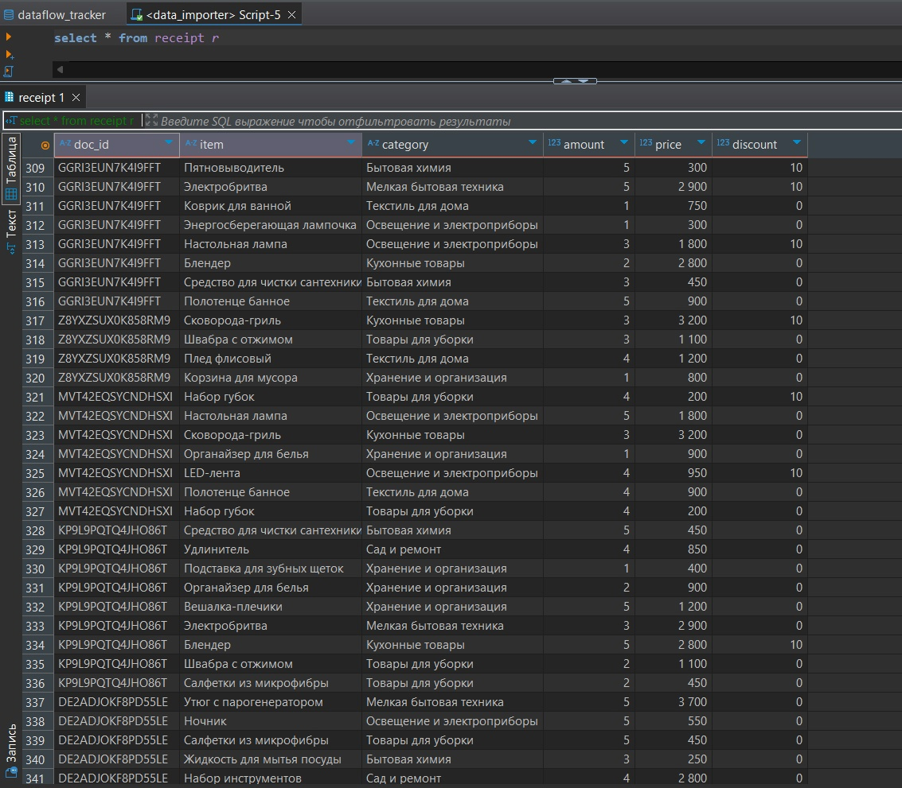

## Программа для выгрузки чеков из CSV файлов в базу данных

---

Для клонирования репозитория, установки библиотек и запуска программы введите команды.

```
git clone https://github.com/Quainter2510/data_importer.git
pip install -r requirements.txt
python main.py
```

### Принцип работы программы

Программа обращается к директории ../householder_goods_store/data и ищет CSV файлы в формате `{{shop_num}}_{{cash_num}}.csv`. Здесь `{{shop_num}}` - номер магазина, а `{{cash_num}}` - номер кассы. После прочтения файлы перемещаются в директорию archive с указанием даты обработки в имени файла. Прочитанные данные загружаются в базу данных.

### Пример вида базы данных



### Автоматизация

Программа загружена на сервер и запускается каждый день в 23:05.
